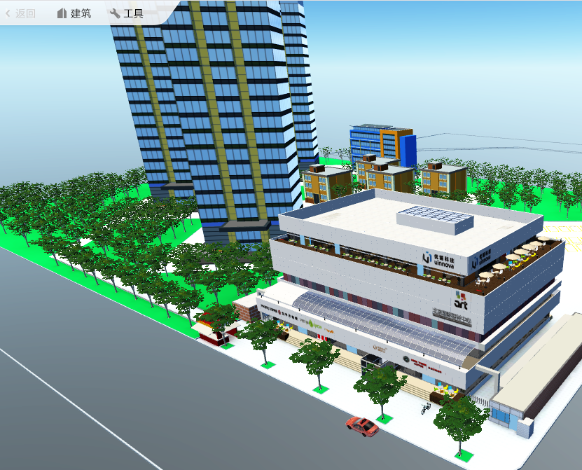
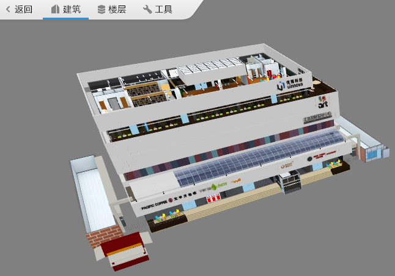
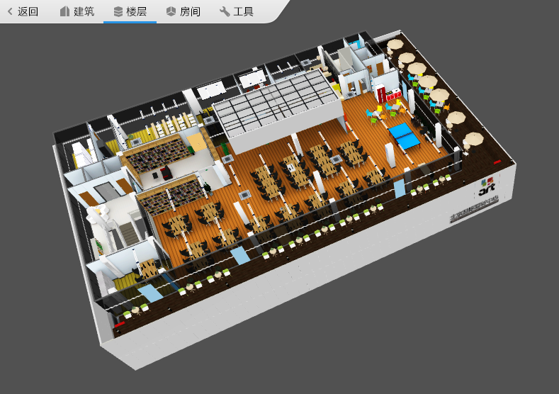
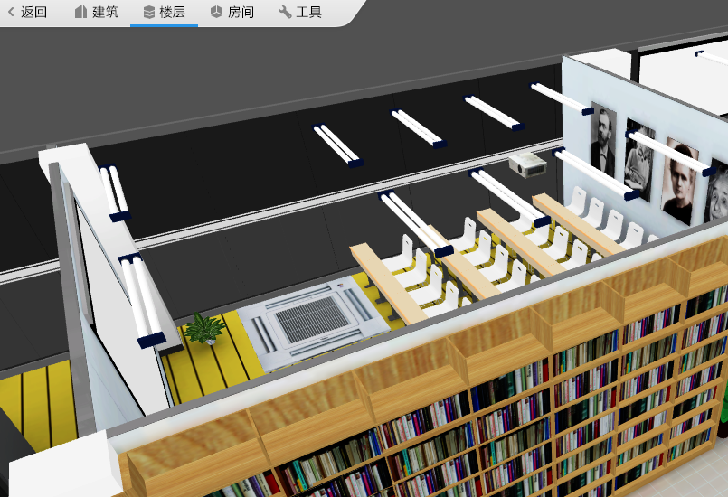
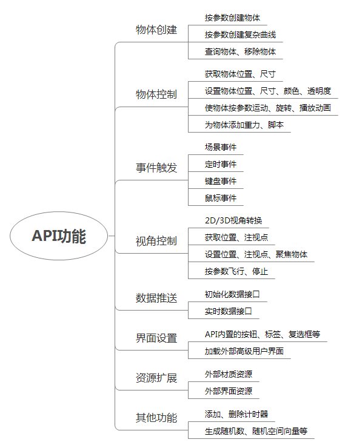

#1 概述
模模搭API是嵌入在模模搭系统内部的、可动态执行的类Javascript脚本，它提供了对模模搭场景内对象、界面行为和效果的控制，可实现特定第三方行业应用，诸如仓储管理、预案演练、档案管理、智能大厦等。

模模搭API具有数据交互能力。通过数据接口，第三方行业应用可驱动特定3D场景各类信息动态变化，满足实时状态可视化展示的要求。
## 1.1 概念说明
### 基本概念：模型和场景

在模模搭体系中有2个重要的概念：模型和场景。

1） 模型

模型是物体的多边形表示，3D模型表达的物体可以是现实世界的实体，也可以是虚构的物体。任何物理自然界存在的东西都可以用3D模型表示。

模模搭系统中的“模型”和一般3D模型概念完全一致。模模搭系统中的3D模型都可以像积木一样放到一个场景中，组合出一个现实的生活场景。

模模搭提供官方的3D模型库，其中公开免费模型库中的模型可供使用者在搭建过程中免费使用；模模搭也可（有偿）提供各类行业模型库，方便用户完成各类更专业的行业应用场景搭建；模模搭还提供了一个3DSMax模型上传插件，用户可使用该插件自行上传自己需要增补的3D模型。理论上模模搭模型库提供了无限模型扩展可能。

2） 场景

场景是模模搭的基本概念。使用者在模模搭中通过组合、摆放模模搭模型库中的模型，可像搭积木一样搭建完成任意现实生活场景，可以是一个园区、一个工厂车间、一个港口码头或其它任意模模搭3D模型组合，上述搭建成的每个场景我们称之为一个“模模搭场景”。

每个模模搭场景都可保存在模模搭云平台上，并可在模模搭平台随时打开编辑、预览或通过API进行二次开发。模模搭场景在一定限制条件下（有偿），也可从模模搭云平台下载本地，并可导入到“模模搭离线部署版”中预览、使用。
### 模型库内容：模型、贴图与功能

在搭建系统的右侧列表中，用户可以使用3种常见的物体：模型、贴图与功能。

1） 模型

一般常见的物体如建筑、车辆、人物、桌子等；支持用户上传。

2） 贴图

覆于普通模型表面的平面材质图；支持用户上传。

3） 功能

动态效果如火、雨、闪电；辅助功能如画线、画水管、写文字等；目前不支持用户上传。

### 场景层级：室外、建筑、楼层、房间
在模模搭体系中有4个层级：室外、建筑、楼层、房间。

1 ）室外

视野范围最大的层级：

2） 建筑

不含外立面的建筑层级：

3 ）楼层

楼层层级：

4 ）房间

房间层级：

## 1.2 API脚本调试与应用

模模搭API可以在线调试，调试页面分为脚本编辑器和可视化场景两部分。首先输入需要的场景ID，然后点击【新建】按钮，此刻场景将载入，调试工作即可开始。
脚本调试完成后，将脚本内容贴到【我的作品】对应场景的【配置场景】弹出框里，之后这个场景在预览时即可运行给定的脚本。

## 1.3 调试页面快捷键

调试页面可以支持快捷键操作，目前具有如下快捷键：

Ctrl+Enter:执行脚本

Ctrl+R:重置场景

Ctrl+/ :代码/注释文本切换
## 1.4 API类参考

模模搭API目前具有如下8种名称空间 ：
 
camera

用于管理场景内的摄像机对象

object

用于管理场景内的物体对象

gui

用于管理场景内的图形界面对象

BaseObject

用于对场景内已存在物体进行具体操作

ScriptObject

用于对场景内已存在物体添加脚本

util

一般的常用方法

input

用于判定键盘鼠标的输入状态

console

用于管理控制台

## 主要功能

API脚本目前可以提供如下功能：

#2 API类参考

* [camera类](Content/camera.md)
* [object类](Content/object.md)
* [gui类](Content/gui.md)
* [BaseObject类](Content/BaseObject.md)
* [ScriptObject类](Content/ScriptObject.md)
* [util类](Content/util.md)
* [input类](Content/input.md)
* [console类](Content/console.md)

